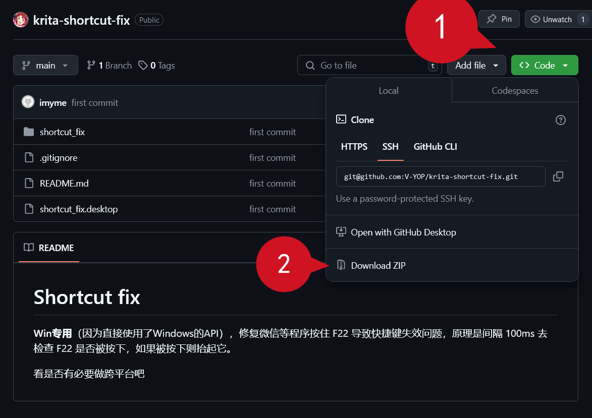
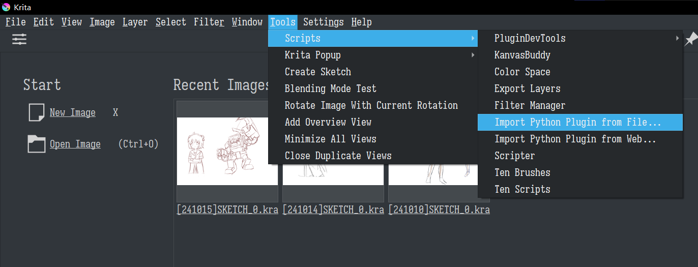
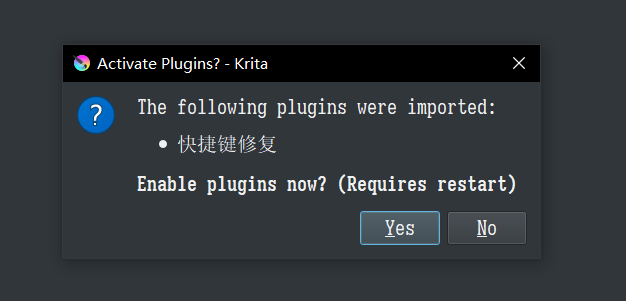

# Shortcut fix

[中文文档](README_zh.md)

**Only for Windows**, Fix krita shortcut problem caused by WeChat and other programs who always holds key F22 by **release F22 in duration**.

Don't know it's necessary or not to make it cross-platform.

# Install

1. Click green button `<> Code` on top right，Click menu item `Download ZIP` to download plugin with ZIP format，**DO NOT EXTRACT IT**。

1. Open Krita，Select menu `Tools`-`Scripts`-`Import Python Plugin From File`，select the zip file downloaded above.

3. Click 'Yes' to enable plugin

4. Restart Krita

# Test

1. Disable plugin "快捷键修复"
2. Restart Krita，Open an image, check if canvas shortcut(like `pan` using `space`) works
3. Open WeChat, Login it.
4. Check if canvas shortcut doesn't work
5. Enable plugin "快捷键修复"
6. repeat step 2 and 3, check if canvas shortcut still works