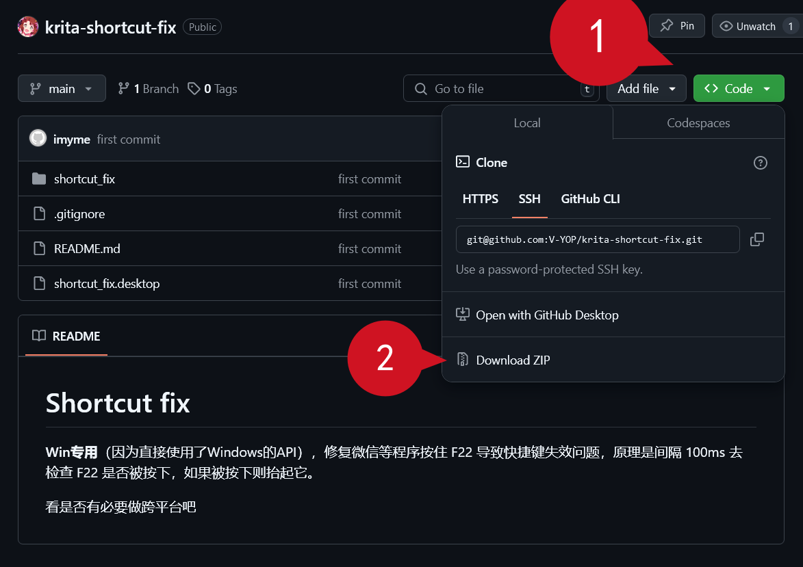
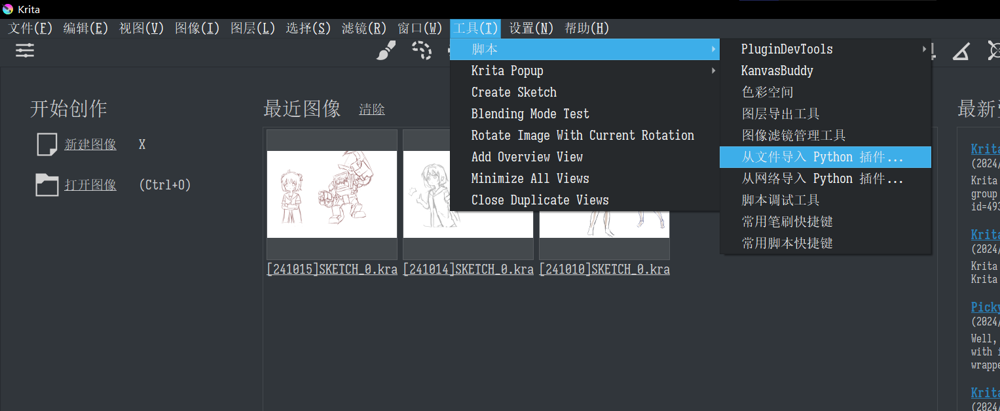

# 快捷键修复 Shortcut fix

[English Documentation](README.md)

**Win 专用**（因为直接使用了 Windows 的 API），修复微信等程序按住 F22 导致快捷键失效问题，原理是**间隔 100ms 去检查 F22 是否被按下，如果被按下则抬起它**。

看是否有必要做跨平台吧。

# 安装

1. 点击右上角绿色按钮`<> Code`，点击`Download ZIP`以下载插件的压缩包，**不要解压它**。

1. 打开 Krita，选择顶部菜单`工具`-`脚本`-`从文件导入 Python 插件`，选择刚刚下载的压缩包

3. 点击“是”以启动插件 

4. 重启 Krita

# 测试

1. 关闭插件 "快捷键修复"
2. 重启 Krita，检查画布快捷键是否可用（比如`Space`移动画布）
3. 打开微信，登陆
4. 检查画布快捷键是否不可用
5. 开启插件 "快捷键修复"
6. 重试步骤 2 和 3，检查画布快捷键是否可用